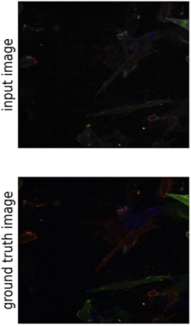
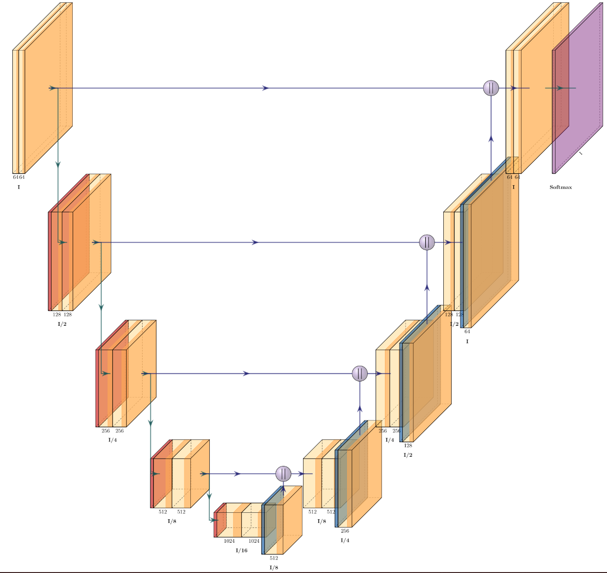

# ProCodesAnalysis

This is the repository for the development of ProCodes image analysis. \
Specifically performing segmentations on neurons via colorization using a U-Net a type of machine learning model.  
Ex:  
Example Inputs             |  Model Architecture
:-------------------------:|:-------------------------:
       |  
 
Before using any python files make sure everything in requirements.txt is installed:  
 <code>pip install -r requirements.txt</code>  or
 <code>conda install --file requirements.txt</code>  
  
Also ensure that you have the following ready:  
* A directory with images as .pt files, with at least two different folders one for training and one for ground truth. 
Currently only 3 channel 
images are supported but as for image height/width sizes can be anything, but need to remain consistent within the same 
folder. Dimensions must be [3 x Width x Height] for training and ground truth.
* A directory to store the model checkpoints
* CUDA-ready GPU, although not 100% necessary training w/ GPU already takes hours upon hours. Without will be endless.

## utils.py
Supports loading images, displaying the codebook, and matching pursuit.

## evaluation.py
Has functions for calculating accuracy/similarity between two images:  
1. Elementwise Accuracy <code>elementwise_accuracy(img_1, img_2, deviation=0.001)</code>
2. Mean Squared Error <code>mse(img_1, img_2)</code>
3. Structural Similarity Index <code>ssim_err(img_1, img_2, img=False)</code>  
    - <code>img</code> is a boolean to decide whether the SSIM image is displayed
4. Identifiable Submatrices, class
>        Finds all possible special matrices given codebook
>        Special matrix in this case is a 6 x 4 matrix where:
>        Condition 1:
>            First 3 rows represent a smaller 3 x 4 subset where each 3 x 1 column is a different permutation
>            (Can be in any order. However, the last column must always be [1 1 1])
>                [[1 0 1 1]
>                 [0 1 1 1]
>                 [1 1 0 1]]
>        Condition 2:
>            Last 3 rows represent 3/4th of an identity matrix
>                [[1 0 0 0]
>                 [0 1 0 0]
>                 [0 0 1 0]]
>        self.clean_matrices is how one would access a set of matrices that are possible given a row order
>        
        x = identifiable_submatrices('codebook.csv')
        x.clean_matrices[(0, 1, 3, 6, 5, 2)]
        ->
        [[array([[0., 1., 1., 1.], # The resulting array
                 [1., 0., 1., 1.],
                 [1., 1., 0., 1.],
                 [1., 0., 0., 0.],
                 [0., 1., 0., 0.],
                 [0., 0., 1., 0.]]),
           array([10,  7,  0, 17])]] # The order of the columns

        # To get the actual row names
        [x.idx_to_row[i] for i in (0, 1, 3, 6, 5, 2)]
        ->
        ['NWS', 'VSVG', 'HSV', 'Ollas', 'S', 'FLAG']

        # To get the actual column names
        [x.idx_to_col[i] for i in [10,  7,  0, 17]]
        ->
        ['D7', 'D11', 'A2', 'F8']
