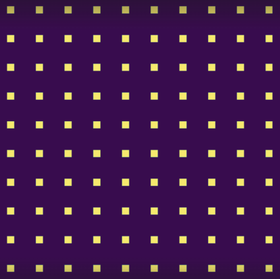
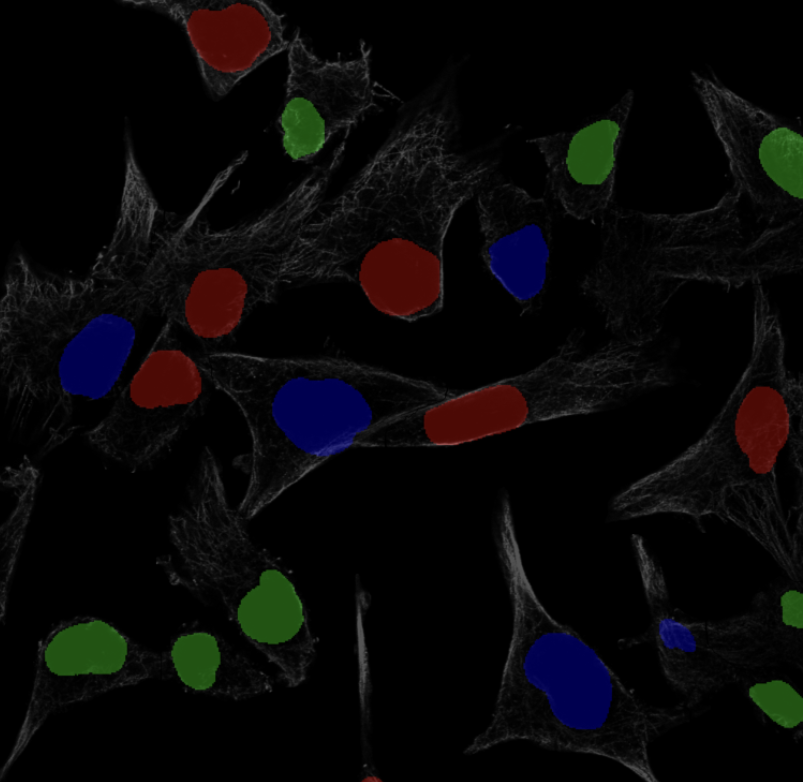

# ProCodesAnalysis

This is the repository for the development of ProCodes image analysis. \
Specifically performing segmentations on neurons via colorization using a U-Net a type of machine learning model.  
Ex:  
Example Inputs             |  Model Architecture
:-------------------------:|:-------------------------:
       |  
 
Before using any python files make sure everything in requirements.txt is installed:  
 <code>pip install -r requirements.txt</code>  or
 <code>conda install --file requirements.txt</code>  
  
Also ensure that you have the following ready:  
* A directory with images as .pt files, with at least two different folders one for training and one for ground truth. 
Currently only 3 channel 
images are supported but as for image height/width sizes can be anything, but need to remain consistent within the same 
folder. Dimensions must be [3 x Width x Height] for training and ground truth.
* A directory to store the model checkpoints
* CUDA-ready GPU, although not 100% necessary training w/ GPU already takes hours upon hours. Without will be endless.

## utils.py
Contains a multitude of helper functions for various tasks.  
* otsu_threshold_channelwise, Will perform otsu thresholding on an input image able to be scaled by a threshold factor
* random_channel_pop, Picks a random channel to remove from image, and returns the new image and the channel separately
* load_tif, Loads a tif file from a given path and 1-max normalizes.
* load_codebook, With a path loads in a csv file as a pandas database
* normalize_array and normalize_array_t, Normalizes a numpy array or a torch tensor respectively
* display_codebook, Displays a codebook as a heatmap on matplotlib.pyplot given a path to a csv
* fixed_blobs, With a set of parameters will create a sparse fixed 2-D array
  
* color_blobs, Given an image return the same image and a new image where it is just n blobs per channel colored in
* plot_loss, With an array of losses, plot Loss vs Epochs and save it
* matching_pursuit, Given an image, and codebook values, and iterations, compute matching pursuit to segment an image
* three_channel_grayscale, given two imgs as numpy arrays(width,height,channel), an image and a mask, return a grayscale image with but with coloring given a mask. 
    
* classification_accuracy, with image, label, and mask of all non-zero pixels of label, compute mean top-1 classification accuracy over all non-zero pixels
* preprocess_and_create_3cg_data, given a path to original data and a path to where output data should be, will create 
a new dataset with 3 channel grayscale and blob properties.
* preprocess_main, wrapper function for the function above, helps create directories if needed.
* connected_components, grabs the connected components from an image.
* random_pixel_data, arguments it takes: path to original data, new data path, output shape of images, and minimum size of components. 
It then creates new dataset where in each channel, the largest component has a single pixel colored in.
* remove_outliers, given an image(numpy), removes the outliers
* make_plotable, makes a torch tensor, normally in the shape of [channels, w, h] into a matplotlib plotable object
* save_img, takes a torch tensor, and then plots it and saves the image
* channel_transform, creates a new training dataset from an existing one where the channels of all the images are permutated.
* kaggle_hpa_renamer, renames the hpa dataset to be more manageable and includes a metadata file
* removes_points, helper function for create_synthetic_dataset_hpa, takes in points a list of all used points and sample space all possible new points
 and removes illegal points from the sample_space
* generate_x_y, also helper function for create_synthetic_dataset_hpa, generates a random positive mask
* create_synthetic_dataset_hpa, takes path to cell bodies, path to outlines, metadata path, max amt of images, cells per channel, and image shape, 
to create a custom dataset using random combinations of singular cell bodies and outlines.
* np_to_torch_img: convert a numpy array(w, h, channels) to torch (channels, w, h)
* hpa_kaggle_transform_data: takes in all the necessary paths to transform 3 types of HPA kaggle data to make a new dataset. 
Similar to the 3 Channel Grayscale type of data. 

## evaluation.py
Has functions for calculating accuracy/similarity between two images:  
1. Elementwise Accuracy <code>elementwise_accuracy(img_1, img_2, deviation=0.001)</code>
2. Mean Squared Error <code>mse(img_1, img_2)</code>
3. Structural Similarity Index <code>ssim_err(img_1, img_2, img=False)</code>  
    - <code>img</code> is a boolean to decide whether the SSIM image is displayed
4. Identifiable Submatrices, class
>        Finds all possible special matrices given codebook
>        Special matrix in this case is a 6 x 4 matrix where:
>        Condition 1:
>            First 3 rows represent a smaller 3 x 4 subset where each 3 x 1 column is a different permutation
>            (Can be in any order. However, the last column must always be [1 1 1])
>                [[1 0 1 1]
>                 [0 1 1 1]
>                 [1 1 0 1]]
>        Condition 2:
>            Last 3 rows represent 3/4th of an identity matrix
>                [[1 0 0 0]
>                 [0 1 0 0]
>                 [0 0 1 0]]
>        self.clean_matrices is how one would access a set of matrices that are possible given a row order
>        
        x = identifiable_submatrices('codebook.csv')
        x.clean_matrices[(0, 1, 3, 6, 5, 2)]
        ->
        [[array([[0., 1., 1., 1.], # The resulting array
                 [1., 0., 1., 1.],
                 [1., 1., 0., 1.],
                 [1., 0., 0., 0.],
                 [0., 1., 0., 0.],
                 [0., 0., 1., 0.]]),
           array([10,  7,  0, 17])]] # The order of the columns

        # To get the actual row names
        [x.idx_to_row[i] for i in (0, 1, 3, 6, 5, 2)]
        ->
        ['NWS', 'VSVG', 'HSV', 'Ollas', 'S', 'FLAG']

        # To get the actual column names
        [x.idx_to_col[i] for i in [10,  7,  0, 17]]
        ->
        ['D7', 'D11', 'A2', 'F8']
